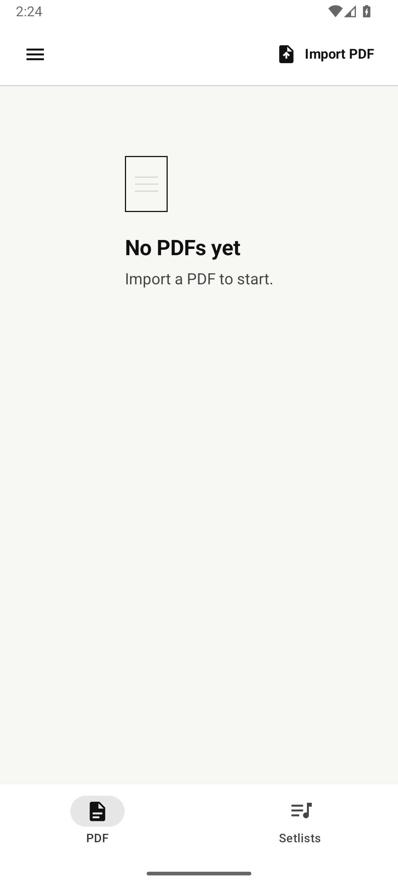
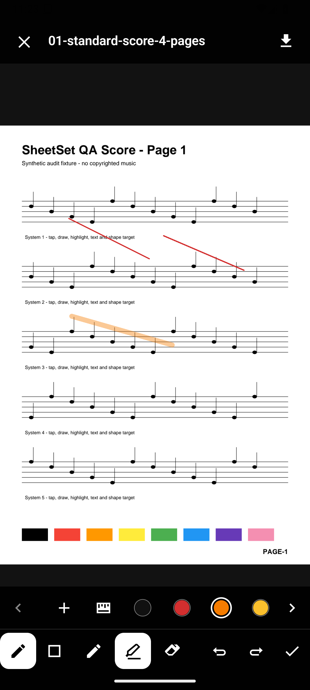
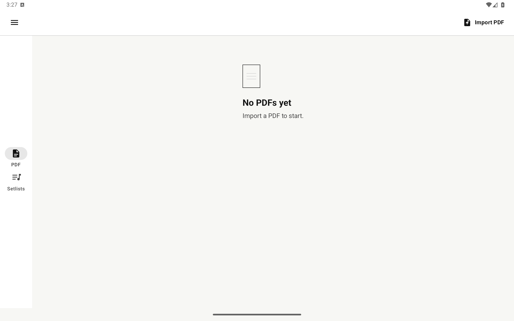

# SheetSet

Offline Android PDF organizer for musicians. Import scores, build unlimited setlists, write annotations, and export a marked-up copy. No account, ads, analytics, cloud service, or Internet permission.

[](https://github.com/Majkey25/SheetSet/actions/workflows/android-ci.yml)
[](https://github.com/Majkey25/SheetSet/releases)
[](LICENSE)


<p align="center">
  
  
  
</p>

## What it does

- Imports one or more PDFs through the Android file picker.
- Stores private offline copies and validates each file before adding it.
- Creates unlimited setlists with direct drag ordering and no duplicated PDFs.
- Reads a setlist continuously across score boundaries.
- Resumes the last page, stores searchable bookmarks, and jumps directly to bookmarked passages.
- Offers Single, Half, and tablet Two-page layouts, Bluetooth pedal/keyboard page turns, and automatic scrolling.
- Organizes scores and setlists with labels, label search, and title/date sorting.
- Supports colored pen, highlight, underline, strike-through, text boxes, lines, arrows, rectangles, and ellipses.
- Selects, moves, resizes, deletes, erases, undoes, and redoes annotations.
- Uses the same two-row bottom editor on phones and tablets, with fixed page/history controls and scrollable tool and color sections.
- Preserves the imported original and exports a new annotated PDF.
- Backs up and safely restores PDFs, setlists, annotations, settings, and language in a validated ZIP.
- Imports ScorePDF backup ZIPs as a non-destructive merge and shares SheetSet backups through Android.
- Uses English, Czech, Slovak, German, Polish, or the Android device language.
- Offers Scan with ScanIt from the import sheet and opens its Google Play listing.

## Install

Download the preview APK from [GitHub Releases](https://github.com/Majkey25/SheetSet/releases). Preview builds are debug-signed and intended for testing. Google Play publishing is not part of this repository yet.

SheetSet requires Android 13 or newer.

## Build

Requirements: JDK 17 and Android SDK 36.

```powershell
.\gradlew.bat testDebugUnitTest lintDebug assembleDebug --no-daemon --console=plain
.\gradlew.bat assembleDebugAndroidTest --no-daemon --console=plain
```

Install the debug APK:

```powershell
adb install -r app\build\outputs\apk\debug\app-debug.apk
```

## Design

SheetSet uses one Android application module, Jetpack Compose, and platform PDF APIs. `LibraryRepository` stores PDFs and an atomic JSON catalog. Versioned typed annotations migrate old pen and highlighter data. `PdfPageView` and `PdfExporter` share one renderer so the on-screen page matches the non-destructive exported copy. Restore validates the complete ZIP in staging before an atomic directory swap with rollback.

The app declares no permissions. Imported files stay in app-private storage. Export writes only to the location selected in the Android document picker.

## Current limits

- Android only.
- PDF text and vector objects are not edited. Annotations are a separate layer drawn by touch.
- Underline and strike-through use manual drag bounds. Scanned PDFs have no OCR.
- Export rasterizes source pages at up to 144 dpi with a 12 MP memory cap.
- Backup restore accepts archives up to 1 GiB. There is no cloud sync.
- Scanning is delegated to the separate ScanIt app; SheetSet has no built-in camera scanner.
- Common page-turn pedals work as keyboards; custom MIDI mappings, audio tools, and a metronome are not included.

See the [adaptive editor specification](docs/superpowers/specs/2026-08-20-sheetset-editor-settings-adaptive-design.md) and [PDF editor plan](docs/superpowers/plans/2026-08-20-sheetset-pdf-editor.md).
The [v0.4 performance specification](docs/superpowers/specs/2026-08-24-sheetset-performance-essentials-design.md) documents bookmarks, layouts, pedals, auto-scroll, labels, migration, and release acceptance.

## Contributing

Read [CONTRIBUTING.md](CONTRIBUTING.md). Report security problems through [GitHub private vulnerability reporting](https://github.com/Majkey25/SheetSet/security/advisories/new).

## License

[MIT](LICENSE)
